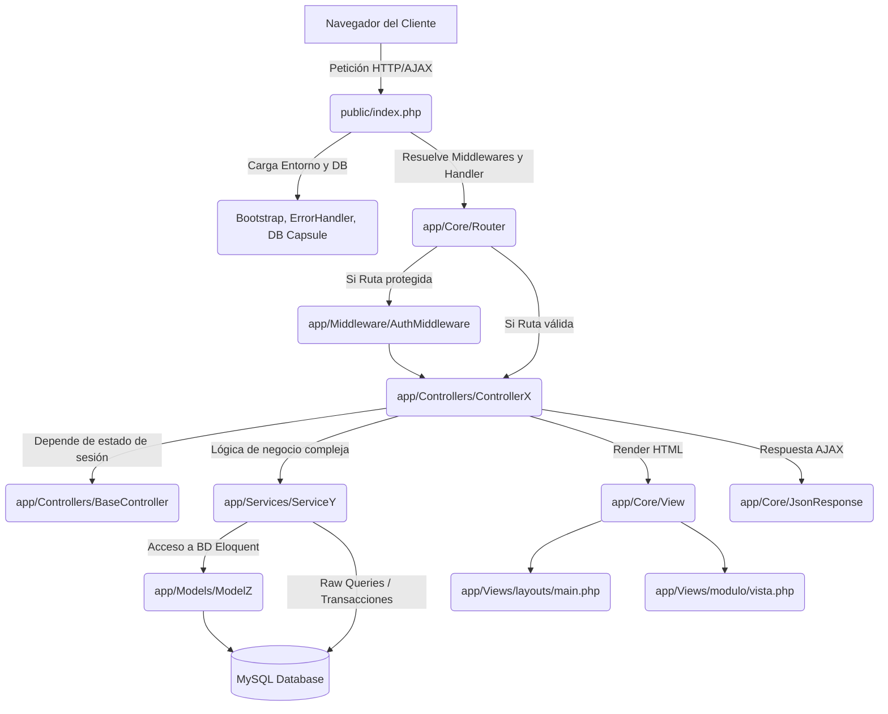

# Mapa de Dependencias

## Propósito

Documentar las dependencias de Portal3: paquetes Composer, librerías frontend y el flujo real de datos entre capas del sistema.

---

## 1. Dependencias PHP (Composer)

| Paquete | Versión | Uso |
|---|---|---|
| `nikic/fast-route` | ^1.3 | Router HTTP |
| `firebase/php-jwt` | ^7.0 | JSON Web Tokens |
| `vlucas/phpdotenv` | ^5.6 | Variables de entorno (.env) |
| `monolog/monolog` | ^3.9 | Logging |
| `filp/whoops` | ^2.18 | Páginas de error en desarrollo |
| `respect/validation` | ^2.4 | Validación de datos |
| `illuminate/database` | ^12.37 | Eloquent ORM (Capsule) |
| `php-di/php-di` | ^7.1 | *(Registrado, posible código muerto)* |
| `guzzlehttp/guzzle` | ^7.10 | HTTP cliente |
| `nesbot/carbon` | ^3.10 | Manejo de fechas |
| `ramsey/uuid` | ^4.9 | Generación de UUIDs |
| `dompdf/dompdf` | ^3.1 | Generación de PDF |
| `setasign/fpdf` | ^1.8 | Generación de PDF (legacy) |
| `bacon/bacon-qr-code` | ^3.1 | Códigos QR (2FA) |
| `phpmailer/phpmailer` | ^7.1 | Envío de correos |
| `phpoffice/phpspreadsheet` | ^5.7 | Generación de Excel |

---

## 2. Dependencias JavaScript (Frontend)

| Librería | Origen | Uso |
|---|---|---|
| Alpine.js (v3) | CDN (unpkg) | Reactividad declarativa |
| Axios | CDN (jsdelivr) | Peticiones HTTP AJAX |
| DOMPurify | CDN (jsdelivr) | Prevención XSS en renderizados Alpine (`x-html`) |
| Bootstrap 5 | Local (`public/assets/libs/`) | Sistema UI CSS |
| DataTables | Local | Tablas interactivas |
| ApexCharts | Local | Gráficos |
| SweetAlert2 | Local | Modales y notificaciones |
| SignaturePad | Local | Firmas digitales |

---

## 3. Flujo Real de Dependencias (Peticiones HTML/AJAX)

El sistema presenta el siguiente árbol real de ejecución, confirmando un acoplamiento donde los Controladores orquestan Vistas y Servicios, y los Servicios interactúan con Modelos Eloquent o directamente con el facade `DB`.



## 4. Dependencias Arquitectónicas del Sistema

```text
Portal3 (App)
 ├── Depende fuertemente de -> app/Core (Framework in-house)
 │    ├── Depende de -> FastRoute (Router)
 │    ├── Depende de -> Illuminate/Database (Eloquent/DB)
 │    ├── Depende de -> Firebase/PHP-JWT (Autenticación)
 │
 ├── Depende de -> app/Controllers (Lógica de entrada)
 │    ├── Dependen de -> app/Services (Reglas de negocio)
 │
 ├── Depende de -> app/Services
 │    ├── Dependen de -> app/Models (Acceso a datos)
 │
 ├── Depende de -> Frontend
      ├── Depende de -> AlpineJS (CDN)
      ├── Depende de -> Axios (CDN)
      └── Depende de -> Bootstrap 5
```
